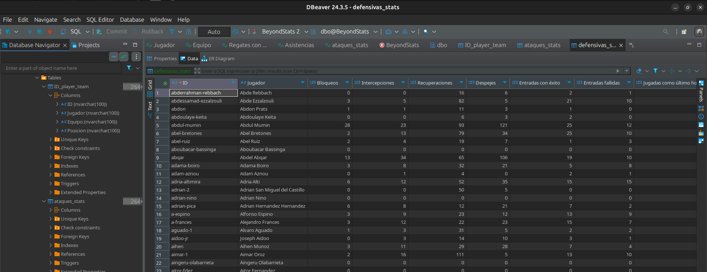

# Project: Web Scraping and Data Analysis - La Liga

This project performs web scraping of La Liga data and stores it in a SQL Server database for further analysis. It is designed to run on a Linux environment, leveraging Linux-compatible tools and libraries for scraping, data processing, and database interaction.

## 1. Clone the repository

To get started, clone the following repository:

```bash
    git clone https://github.com/jorgearma/data-analysis-la_liga.git
```

Access the project folder:

```bash
    cd data-analysis-la_liga/Web_scraping-SQL
```

## 2. Create the container and databasegit

To run SQL Server in a Docker container, use the following command:

```bash
docker run -e 'ACCEPT_EULA=Y' -e 'SA_PASSWORD=yourPASSWORD' \
-p 1433:1433 \
-v /your/directory/data-analysis-la_liga/jornadas:/var/opt/mssql/sql_files \
--name BD-name \
-d mcr.microsoft.com/mssql/server:2019-latest
```

**Note:** The path `/your/directory/BeyondStats-LaLiga/jornada` must match the location where the project was downloaded.

## Step 3: Modify the Target Directory

Before modifying the directory in the scripts, it is recommended to create an instance and ensure that all necessary dependencies are installed. Follow these steps:

1. **Create an Instance**
   - It is recommended to run the script in an isolated environment or on a suitable server where the Docker container hosting the SQL Server database is mounted.
        ```bash
        python -m venv venv

        source venv/bin/activate
        ```
   
2. **Install Dependencies**
   - Before running the scripts, install all required dependencies by executing:
     ```bash
     pip install -r requirements.txt
     ```
   - This ensures that all necessary libraries are available.

3. **Update the Directory in the Scripts**
   - Inside the following scripts, update the `directory` variable with the path where the Docker container is mounted to host the SQL Server database.
   
   **Files to Modify:**
   - `indice-posicion.py`
   - `Scraping_Stats_LaLiga.py`

   **Line to Modify:**
   ```python
   directory = '/your/directory/data-analysis-la_liga/jornadas/jornada25'
   ```
   - Replace `'/your/directory/...` with the appropriate path for your configuration.

By following these steps, you will ensure that the scripts run correctly in your environment.

## 4. Run the scripts

Run the scripts to perform web scraping and store the data in the database:

```bash
    python indice-posicion.py
    python Scraping_Stats_LaLiga.py
```

## 5. Normalize player names

After running the previous scripts, it is necessary to normalize player names using the `Text-Normalizer.py` script. Before executing it:

```python
┌──(la-liga)─(siemprearmando㉿elfavo)-[~/Desktop/data-analysis-la_liga] ➟ main
└─$ python3  Text-Normalizer.py 

Enter the name of the dataframe (example: jornada27): 
```
Here, you should enter the dataframe name you want to normalize, you will find it in ```jornadas```

## 6. Configure Docker and SQL Server

Ensure that the Docker container with SQL Server is running and accessible. You can check running containers with:

```bash
    docker ps
```

If necessary, start the container with:

```bash
    docker start <container_name>
```

Then, enter the database and create it with the following command:

```bash
    sqlcmd -S localhost -U sa -P yourPASSWORD    
    CREATE DATABASE BeyondStats;
    GO
```

Next, run the SQL script to add the data:

```bash
    sqlcmd -S localhost -U sa -P yourPASSWORD -i Create-tables.sql
```

##

## picture
This is the result obtained after executing the scripts. The database has been successfully created and populated with the necessary data, and everything is now ready to use Pandas for further data analysis.



\## Créditos


The original code was developed by Sergio Prieto García. You can find the original repository [here]\([https://github.com/SergioPrietoGarcia/BeyondStats-LaLiga.git](https://github.com/SergioPrietoGarcia/BeyondStats-LaLiga.git)).
